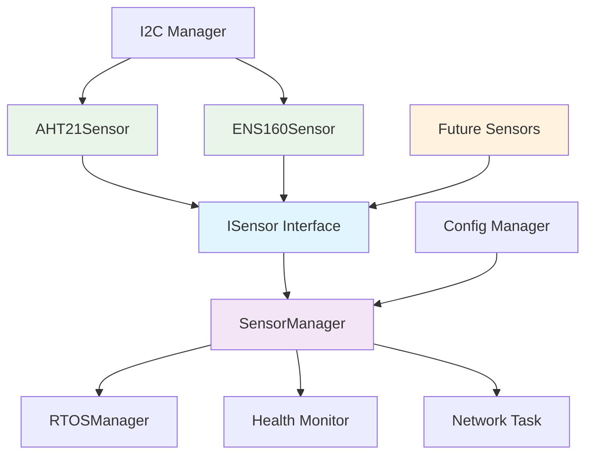
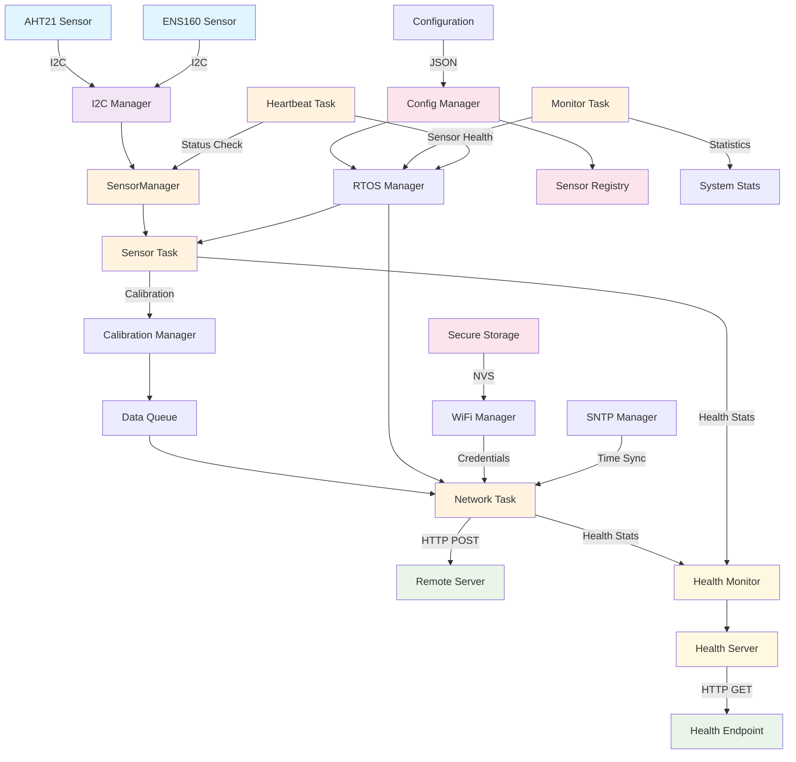
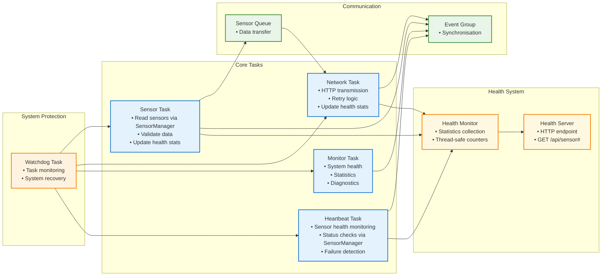
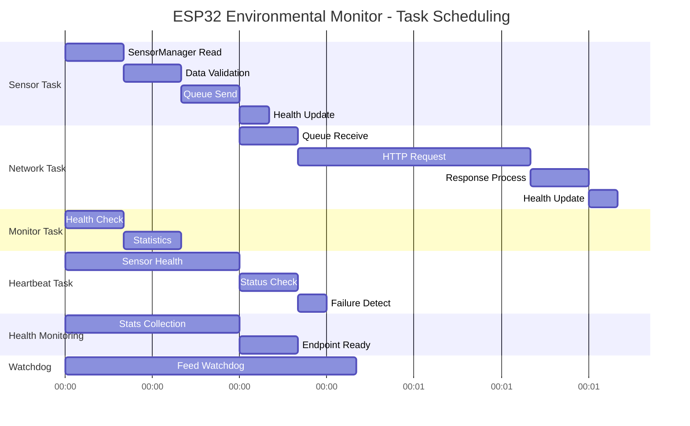

# ESP32 Environmental Monitoring System

An embedded environmental monitoring system built for the ESP32-C3. With the help of FreeRTOS, it reads temperature, humidity, and air quality data from sensors and sends it to a remote server over WiFi.

### Sensors
- **AHT21**: Temperature and humidity sensor with I2C communication
- **ENS160**: Air quality sensor that measures TVOC, eCO2, and AQI
- **I2C Manager**: Handles all the I2C communication in one place

### **Networking**
- **WiFi**: Connects to your network using credentials stored securely in NVS
- **HTTP Client**: Sends JSON data to your server with retry logic
- **SNTP**: Syncs time for accurate timestamps
- **Health Server**: Custom HTTP server providing system health monitoring

### **Configuration**
- **JSON config**: All settings in a JSON file that gets embedded in the firmware
- **Secure storage**: WiFi passwords and server URLs stored encrypted
- **Calibration**: Configurable sensor calibration and validation
- **User-configurable**: Sensor reading intervals, network transmission intervals, and validation thresholds are all configurable via settings.json

## Architecture

### ** Sensor Management**



### **Data Flow**


### **Task Structure**



### **Task Scheduling and Timing**



**Note**: All timing intervals are user-configurable via settings.json. Default values shown above can be customised at build time.

### **Health Monitoring System**

The system includes a comprehensive health monitoring system that tracks:

#### **Real-time Statistics**
- **Sensor readings**: Total successful and failed readings
- **Network transmissions**: Total successful and failed HTTP requests
- **System uptime**: Continuous uptime tracking
- **Memory usage**: Free memory monitoring
- **WiFi signal strength**: Connection quality monitoring

#### **Sensor Health**
- **Sensor connectivity**: AHT21 and ENS160 connection status
- **Success rates**: Percentage of successful sensor readings
- **Sensor states**: Current operational state (ready, warm_up, etc.)
- **Zero readings count**: Tracks invalid sensor data

#### **Network Health**
- **HTTP success rate**: Percentage of successful transmissions
- **Average response time**: Network performance metrics
- **Retry attempts**: Total retry attempts for failed requests

### **Health Endpoint**

The system provides a health monitoring endpoint at `http://<esp32-ip>/api/health`:

#### **Request**
```http
GET /api/health
```

#### **Response**
```json
{
  "device": "ESP32_Sensor_01",
  "timestamp": "2024-01-15T14:30:00Z",
  "uptime_seconds": 259200,
  "system_health": {
    "sensor_readings_total": 4320,
    "sensor_readings_failed": 12,
    "network_transmissions_total": 1440,
    "network_transmissions_failed": 8,
    "memory_free_bytes": 23552,
    "wifi_signal_dbm": -45,
    "watchdog_resets": 0
  },
  "sensor_health": {
    "aht21_connected": true,
    "ens160_connected": true,
    "aht21_success_rate": 99.7,
    "ens160_success_rate": 99.2,
    "zero_readings_count": 15,
    "aht21_state": "ready",
    "ens160_state": "warm_up"
  },
  "network_health": {
    "http_success_rate": 99.4,
    "average_response_time_ms": 1200,
    "retry_attempts_total": 23
  }
}
```
