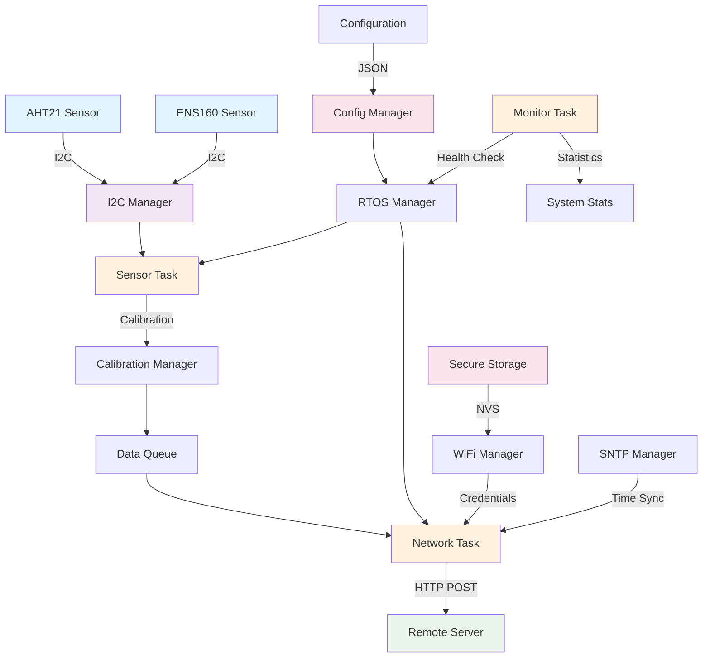
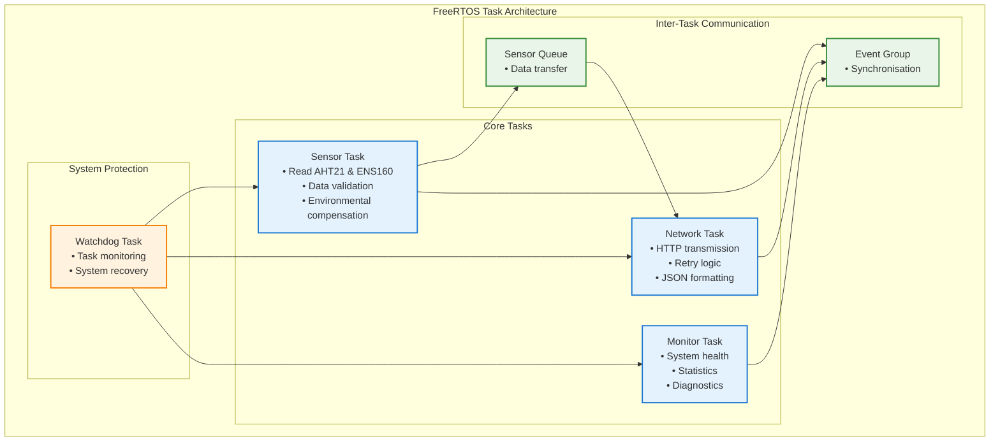
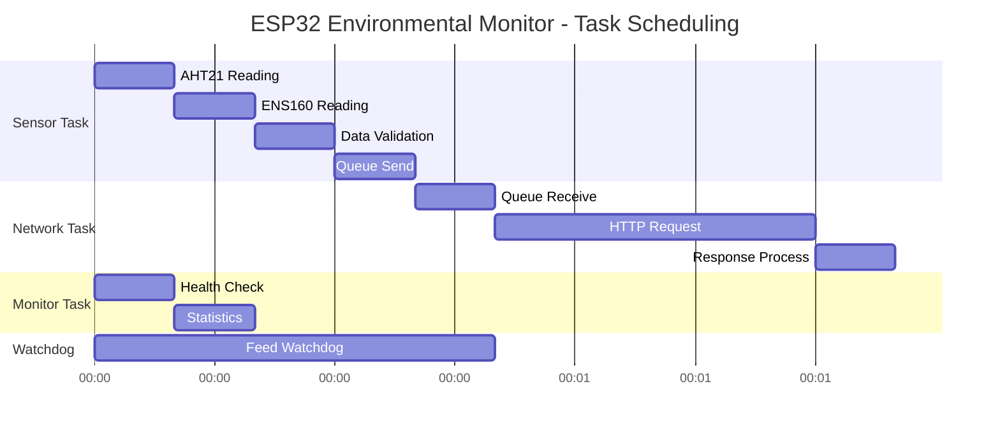
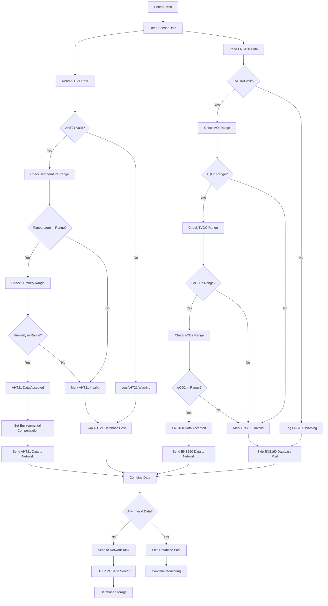

# ESP32 Environmental Monitoring System

An embedded environmental monitoring system built for the ESP32-C3. With the help of FreeRTOS, it reads temperature, humidity, and air quality data from sensors and sends it to a remote server over WiFi.

### Sensors
- **AHT21**: Temperature and humidity sensor with I2C communication
- **ENS160**: Air quality sensor that measures TVOC, eCO2, and AQI
- **I2C Manager**: Handles all the I2C communication in one place

### Networking
- **WiFi**: Connects to your network using credentials stored securely in NVS
- **HTTP Client**: Sends JSON data to your server with retry logic
- **SNTP**: Syncs time for accurate timestamps

### Configuration
- **JSON config**: All settings in a JSON file that gets embedded in the firmware
- **Secure storage**: WiFi passwords and server URLs stored encrypted
- **Calibration**: Configurable sensor calibration and validation
- **User-configurable**: Sensor reading intervals, network transmission intervals, and validation thresholds are all configurable via settings.json

## Architecture

### Data Flow

### Task Structure

### Task Scheduling and Timing

**Note**: All timing intervals are user-configurable via settings.json. Default values shown above can be customised at build time.

### Sensor Data Validation Flow

**Note**: All validation thresholds (temperature, humidity, AQI, TVOC, eCO2 ranges) are user-configurable via settings.json.

## Key System Components

### Tasks
- **Sensor Task**: Reads AHT21 and ENS160 sensors every 1 minute (configurable)
- **Network Task**: Handles HTTP transmission to server with configurable retry logic
- **Monitor Task**: System health monitoring and statistics collection
- **Watchdog Task**: Prevents system hangs and provides recovery mechanisms
- **Heartbeat Task**: Sensor health monitoring

### Data Flow
1. **Sensor Reading**: AHT21 → ENS160 (environmental compensation)
2. **Data Validation**: Threshold checking for AQI, TVOC, eCO2 (all configurable)
3. **Queue Management**: Inter-task communication via FreeRTOS queues
4. **Network Transmission**: HTTP POST with configurable retry logic
5. **Database Storage**: Server-side data persistence

### Error Handling
- **Sensor Failures**: Automatic reset and recovery mechanisms
- **Network Failures**: Configurable retry logic and timeout settings
- **System Monitoring**: Watchdog and heartbeat protection

### User Configuration
All system parameters are configurable via settings.json:
- **Sensor reading intervals**: How frequently sensors are read
- **Network transmission intervals**: How often data is sent to server
- **Validation thresholds**: Acceptable ranges for all sensor data
- **Retry logic**: Network retry attempts and delays
- **WiFi settings**: SSID, password, and connection timeouts
- **Server settings**: URL, request timeouts, and authentication 
