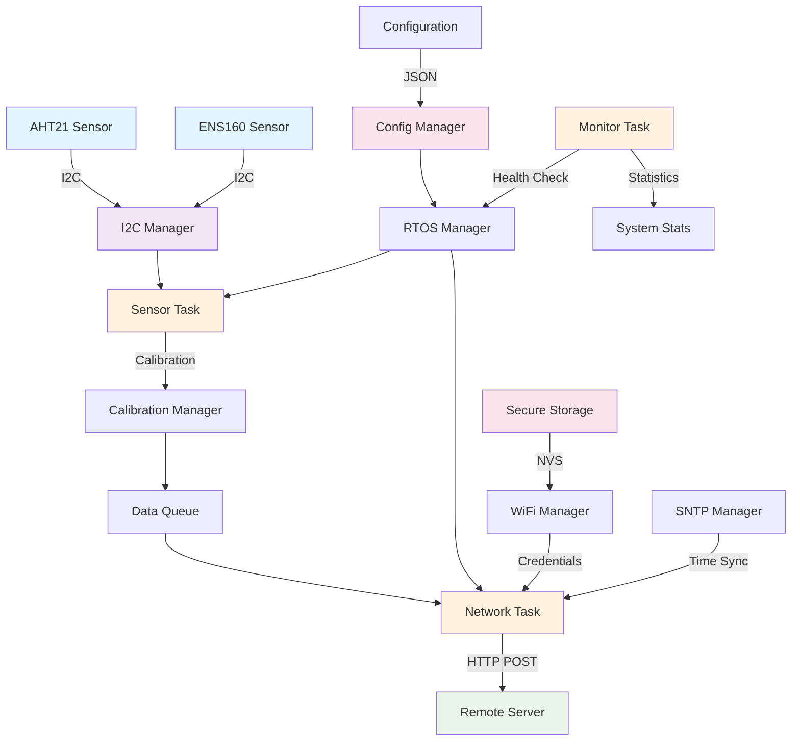

# ESP32 Environmental Monitoring System

An embedded environmental monitoring system built for the ESP32-C3. With the help of FreeRTOS, It reads temperature, humidity, and air quality data from sensors and sends it to a remote server over WiFi.

### Sensors
- **AHT21**: Temperature and humidity sensor with I2C communication
- **ENS160**: Air quality sensor that measures TVOC, eCO2, and AQI
- **I2C Manager**: Handles all the I2C communication in one place

### Networking
- **WiFi**: Connects to your network using credentials stored securely in NVS
- **HTTP Client**: Sends JSON data to your server with retry logic
- **SNTP**: Syncs time for accurate timestamps

### Configuration
- **JSON config**: All settings in a JSON file that gets embedded in the firmware
- **Secure storage**: WiFi passwords and server URLs stored encrypted
- **Calibration**: Configurable sensor calibration and validation

## Architecture


### Data Flow


### Task Structure
```
┌─────────────────┐    ┌─────────────────┐    ┌─────────────────┐
│   Sensor Task   │    │  Network Task   │    │  Monitor Task   │
│                 │    │                 │    │                 │
│ • Read sensors  │    │ • HTTP client   │    │ • System health │
│ • Queue data    │    │ • Retry logic   │    │ • Watchdog feed │
│ • Calibration   │    │ • JSON format   │    │ • Statistics    │
└─────────────────┘    └─────────────────┘    └─────────────────┘
         │                       │                       │
         └───────────────────────┼───────────────────────┘
                                 │
                        ┌─────────────────┐
                        │   Event Group   │
                        │   & Queues      │
                        └─────────────────┘
```

